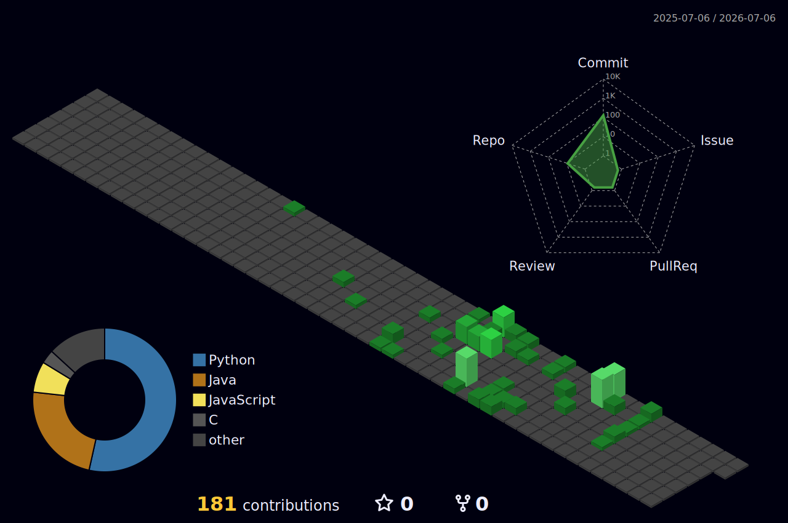

# DevNexe

**Python developer. I build things for fun and because I can.**

---

## About

Python developer focused on building tools from scratch. I don't use `eval` or `exec` — I write real interpreters. Open source by default, not by obligation.

---

## Projects

### 🌑 [Nox](https://github.com/DevNexe/nox)
A general-purpose programming language written in pure Python.

- Tree-walking interpreter with custom lexer, parser and AST
- `define` / `result` keywords, structs, classes, traits
- Async/await, pattern matching, decorators
- C/C++ FFI via ctypes
- Built-in HTTP server
- GitHub-based package manager
- Optional JIT via Numba
- Standalone binary compilation

---

## Stack

**Language**

**GUI / Desktop**

**Tools & Tech**

---

## Stats

---

building in public · open source · always learning

